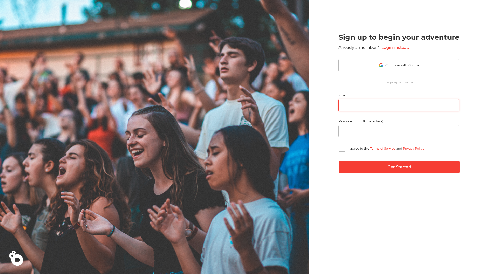

# OutStem Front-end Challenge

Welcome to the OutStem front-end challenge. Submission instructions are listed below. The deadline to submit this challenge is **May 24th 11:59pm**. We would like to emphasize that we are looking for effort, and that the challenge is just part of our discussion with you during the interview, so don’t worry if your solution is *hacky* or even if it doesn’t work, we want to see it! 

## Challenge - User Authentication Screen
Using Javascript/TypeScript and any framework, your assignment is to implement a responsive signup form and get it looking as close to the design as possible. The expected completion time for this assignment is 2 hours.

### Brief
The design team at OutStem has provided you with designs for a new signup form! Your task is to build out the project to the designs inside this folder. You can use any tools you like to help you complete the challenge. So if you've got something you'd like to practice, feel free to give it a go.

## Mockups

### Notes
- The *Terms of Service* and *Privacy Policy* can be blank links
- *Continue with google button* can be a blank button
- The *Login Instead* link can be a blank link, you don't need to implement a sign in UI (unless you want to). 

## Technical requirements

- Implement assignment using:
  - Language: Javascript/TypeScript (Prefer Typescript)
  - Framework: any framework (Prefer Angular or React)
- Your users should be able to:
  - View the optimal layout for the site depending on their device's screen size
  - See hover states for all interactive elements on the page
  - Receive an error message when the form is submitted if:
    - Any input field is empty. The message for this error should say "[Field Name] cannot be empty"
    - The email address is not formatted correctly (i.e. a correct email address should have this structure: name@host.tld). The message for this error should say "This doesn't look like an email, please try again."
    - User did not check the terms of service checkbox.
- You will find all the required assets in the /assets folder. The assets are already optimized, you may also use your own assets.
- There is also a `style-guide.md` file, containing the information you'll need, such as color palette and fonts.

## Evaluation Criteria

- Javascript/TypeScript best practices
- Show us your work through your commit history
- We're looking for you to produce working code, with enough room to demonstrate how to structure components in a small program
- Completeness: did you complete the features?
- Correctness: does the functionality act in sensible, thought-out ways?
- Maintainability: is it written in a clean, maintainable way?
- Testing: is the system adequately tested?

## Pluses (nice to haves)

- Implement a sign in screen
- Open a modal when user clicks on terms of service or privacy policy

## Submission
Please submit your solution in the 2021 Fall interview GitHub repository.

### Via Pull Request (Recommended)
Edit the SUBMISSION.md file and pull request your changes. Make sure to include the following information in the file:
-	A link to your hosted application (you can host it for free using GitHub Pages, Netlify, Vercel, or Heroku)
-	A link to your public repository
-	Any additional information you would like us to know about.

### Via GitHub Issue
You can also submit your solution via GitHub Issues, create an issue in the repository with the following information:
-	A link to your hosted application (you can host it for free using GitHub Pages, Netlify, Vercel, or Heroku)
-	A link to your public repository
-	Any additional information you would like us to know about.
